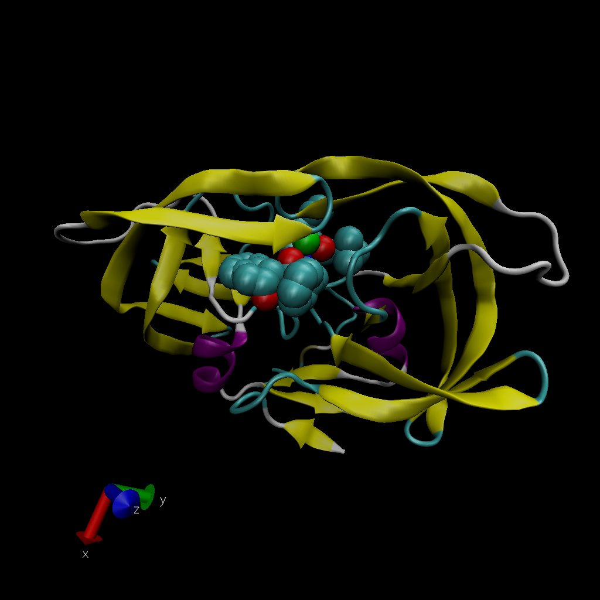

# 1. Introduction to the RCSB Protein Data Bank (PDB)

Download a CSV file from the PDB site (accessible from “Analyze” > “PDB Statistics” > “by Experimental Method and Molecular Type”. Move this CSV file into your RStudio project and use it to answer the following questions:

```{r}
db<-read.csv("Data Export SUmmary.csv",row.names=1)
head(db)
```


> Q1. What percentage of structures in the PDB are solved by X-Ray and Electron Microscopy?

```{r}
methodsums<-colSums(db)
round(methodsums/methodsums["Total"] *100,2)
```

#### Answer:
87.17% of structures in the PDB are solved by X-Ray, and 5.39% are solved by Electron Microscopy. 

> Q2. What proportion of structures in the PDB are protein?

```{r}
typesums <- rowSums(db)
round( (db$Total/methodsums["Total"]) * 100,2)

# First element is protein (only)
```

#### Answer:
87.26% of structures in the PDB are protein.

> Q3. Type HIV in the PDB website search box on the home page and determine how many HIV-1 protease structures are in the current PDB?

#### Answer:
There are 1828 HIV-1 protease structures in the current PDB.

# 2. Visualizing the HIV-1 protease structure


> Q4. Water molecules normally have 3 atoms. Why do we see just one atom per water molecule in this structure?

#### Answer:
We only see one atom per water molecule (H2O) in this structure because the resolution capacity is not high enough to display two hydrogen atoms that are significantly smaller than the oxygen atom. Hence, we only see the oxygen atom of the water molecule.

> Q5. There is a conserved water molecule in the binding site. Can you identify this water molecule? What residue number does this water molecule have?

#### Answer:
Conserved water molecule in the binding site has residue number 308.  



> Q6. As you have hopefully observed HIV protease is a homodimer (i.e. it is composed of two identical chains). With the aid of the graphic display and the sequence viewer extension can you identify secondary structure elements that are likely to only form in the dimer rather than the monomer?

#### Answer:
Yes. As shown on the generated VMD graphical representation, I observe multiple secondary structure elements in different colors other than sequences corresponding to B-factor and secondary structure elements. Noticeably, extended beta structure in yellow at chain B residue 3 and alpha helix structures in purple at residue 87-92 are likely to only form in the dimer rather than the monomer.

# 3. Introduction to Bio3D in R

```{r}
#install.packages("bio3d")
library(bio3d)
# Reading PDB file data into R
pdb <- read.pdb("1hsg")
pdb
```

```{r}
aa123(pdbseq(pdb))
```

```{r}
attributes(pdb)
```

```{r}
head(pdb$atom)
```


> Q7. How many amino acid residues are there in this pdb object?

#### Answer:
There are 198 amino acid residues in this pdb object.

> Q8. Name one of the two non-protein residues?

#### Answer:
One of the 2 non-protein residues is MK1 (residue # 1).

> Q9. How many protein chains are in this structure?

#### Answer:
There are 2 protein chains in this structure.

# 4. Comparative structure analysis of Adenylate Kinase

```{r}
# Setup: Install packages in the R console not your Rmd

#install.packages("bio3d")
#install.packages("ggplot2")
#install.packages("ggrepel")
#install.packages("devtools")
#install.packages("BiocManager")

#BiocManager::install("msa")
#devtools::install_bitbucket("Grantlab/bio3d-view")
```


> Q10. Which of the packages above is found only on BioConductor and not CRAN?

#### Answer:
"msa" package is found only on BioConductor and not CRAN.

> Q11. Which of the above packages is not found on BioConductor or CRAN?

#### Answer:
"bio3d-view" package is not found on BioConductor or CRAN.

> Q12. True or False? Functions from the devtools package can be used to install packages from GitHub and BitBucket?

#### Answer:
True


```{r}
library(bio3d)
aa <- get.seq("1ake_A")
aa
```

> Q13. How many amino acids are in this sequence, i.e. how long is this sequence?

#### Answer:
There are 214 amino acids in this sequence. 

```{r}
# Blast or hmmer search 
b <- blast.pdb(aa)
```

```{r}
# Plot a summary of search results
hits <- plot(b)
```

```{r}
# List out some 'top hits'
head(hits$pdb.id)
```

```{r}
hits <- NULL
hits$pdb.id <- c('1AKE_A','6S36_A','6RZE_A','3HPR_A','1E4V_A','5EJE_A','1E4Y_A','3X2S_A','6HAP_A','6HAM_A','4K46_A','3GMT_A','4PZL_A')
```

```{r}
# Download releated PDB files
files <- get.pdb(hits$pdb.id, path="pdbs", split=TRUE, gzip=TRUE)
```

** Stop here: what we covered in class **
