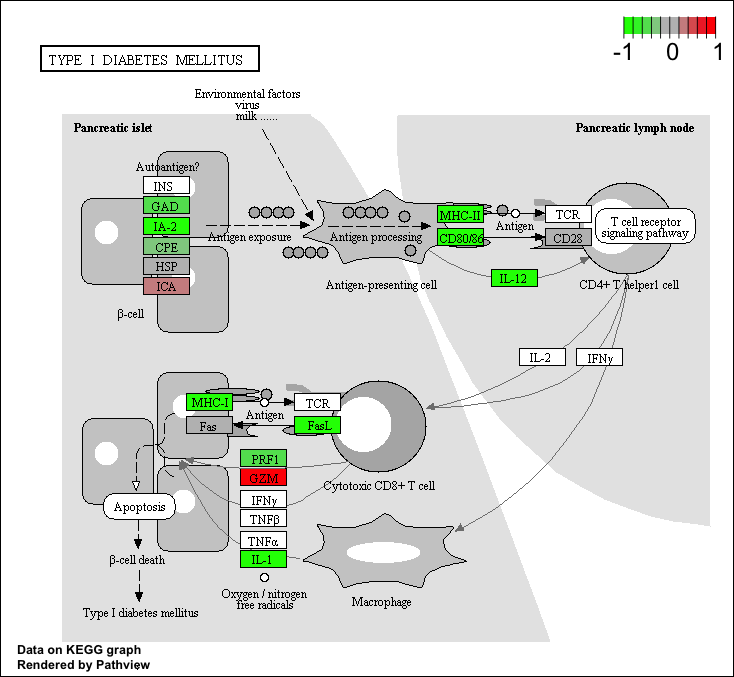
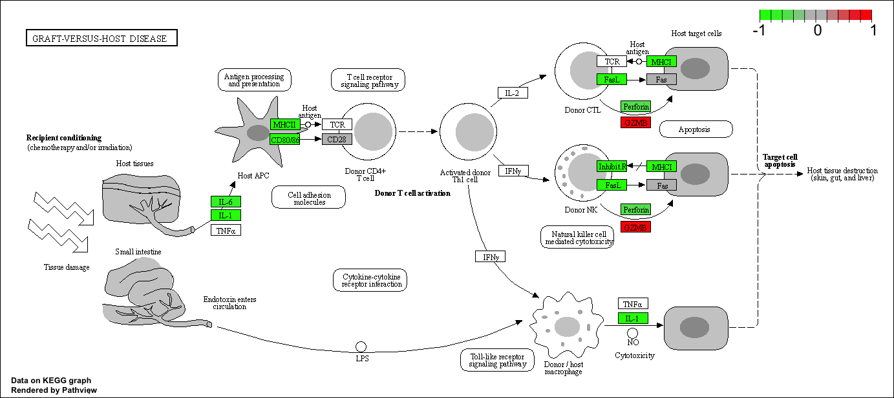

# 1. Bioconductor and DESeq2 setup

```{r}
#install.packages("BiocManager")
#BiocManager::install()
#BiocManager::install("DESeq2")
library(BiocManager)
library(DESeq2)
```

# 2. Import countData and colData

```{r}
# Use the read.csv() function to read these count data and metadata files.
counts <- read.csv("airway_scaledcounts.csv", row.names=1)
metadata <-  read.csv("airway_metadata.csv")
```

```{r}
head(counts)
```

```{r}
head(metadata)
```

> Q1. How many genes are in this dataset?

```{r}
nrow(counts)
```

#### Answer:
There are 38,694 genes in this dataset.

> Q2. How many ‘control’ cell lines do we have?

```{r}
sum(metadata$dex=="control")
```

#### Answer:
We have 4 control cell lines in this dataset.

# 3. Toy differential gene expression

Lets perform some exploratory differential gene expression analysis.

First, need to extract all the control columns, then generate row-wise mean to get the average count values for all gene in these 4 experiments.

```{r}
control <- metadata[metadata[,"dex"]=="control",]
control.counts <- counts[ ,control$id]
control.mean <- rowSums( control.counts )/4 
head(control.mean)
```

An alternative way to do this same thing using the dplyr package from the tidyverse is shown below. Which do you prefer and why?

```{r}
library(dplyr)
control <- metadata %>% filter(dex=="control")
control.counts <- counts %>% select(control$id) 
control.mean <- rowSums(control.counts)/4
head(control.mean)
```

> Q3. How would you make the above code in either approach more robust?

#### Answer:
In both approaches, `control.mean` should be defined as `rowMeans(control.count)` to make the code more robust for using different datasets. Above example codes divided the mean by 4 because there are 4 control samples in the dataset (control.mean <- rowSums(control.counts)/4). 

> Q4. Follow the same procedure for the treated samples (i.e. calculate the mean per gene across drug treated samples and assign to a labeled vector called treated.mean)

#### Answer:
```{r}
treated <- metadata[metadata$dex=="treated",]
treated.counts <- counts[,treated$id]
treated.mean <- rowMeans(treated.counts)
```

Store these results together in a new data fram called `meancounts`.

```{r}
meancounts <- data.frame(control.mean, treated.mean)
colSums(meancounts)
```

> Q5 (a). Create a scatter plot showing the mean of the treated samples against the mean of the control samples.

#### Answer:
```{r}
plot(meancounts[,1],meancounts[,2], xlab="Control", ylab="Treated")
```

> Q5 (b).You could also use the ggplot2 package to make this figure producing the plot below. What geom_?() function would you use for this plot?

```{r}
library(ggplot2)

ggplot(meancounts) +
  aes(meancounts[,1],meancounts[,2]) +
  labs(x="control.mean", y="treated.mean") +
  geom_point(alpha=0.5)
```

#### Answer:
We can use `geom_points()` to produce the above plot.

We will make a log-log plot to draw out this skewed data and see what is going on.

> Q6. Try plotting both axes on a log scale. What is the argument to plot() that allows you to do this? 

```{r}
plot(meancounts[,1],meancounts[,2], xlab="log Control", ylab="log Treated", log="xy")
```

#### Answer:
The `log` argument allows to plot both axes on a log scale.

We can find candidate differentially expressed genes by looking for genes with a large change between control and dex-treated samples. We usually look at the log2 of the fold change because it has a better mathematical property where: if there is no change, log2 value will be zero; if it doubled, log2 value will be 1; and if halved, log2 value will be -1.  

So let's add a log2 fold change column to our results so far.

```{r}
meancounts$log2fc <- log2(meancounts$treated.mean/meancounts$control.mean)
head(meancounts)
```

The `NaN` is returned when you divide by zero and try to take the log. The `-`Inf` is returned when you try to take the log of zero. It turns out that there are a lot of genes with zero expression. Let’s filter our data to remove these genes. Again inspect your result (and the intermediate steps) to see if things make sense to you.

```{r}
zero.vals <- which(meancounts[,1:2]==0, arr.ind=TRUE)

to.rm <- unique(zero.vals[,1])
mycounts <- meancounts[-to.rm,]
head(mycounts)
```
How many genes are remaining?

```{r}
nrow(mycounts)
```

> Q7. What is the purpose of the arr.ind argument in the which() function call above? Why would we then take the first column of the output and need to call the unique() function?

#### Answer:
The purpose of the `arr.ind` argument in the `which()` function is to return the row and column indices where there are TRUE values. In this case, this will tell us which genes (rows) and samples (columns) have 0 count. 
Calling `unique()` function will ensure that we don't count any row twice if it has 0 entries in both samples (some rows and columns can have 0's at the same time and count twice).

A common threshold used for calling something differentially expressed is a log2(FoldChange) of greater than 2 or less than -2. Let’s filter the dataset both ways to see how many genes are up or down-regulated.

```{r}
up.ind <- mycounts$log2fc > 2
down.ind <- mycounts$log2fc < (-2)
```

> Q8. Using the up.ind vector above can you determine how many up regulated genes we have at the greater than 2 fc level?

```{r}
sum(up.ind)
```

#### Answer:
We have 250 up-regulated genes at the greater than 2 fc level.

> Q9. Using the down.ind vector above can you determine how many down regulated genes we have at the greater than 2 fc level?

```{r}
sum(down.ind)
```

#### Answer:
We have 367 down-regulated genes at the greater than 2 fc level.

> Q10. Do you trust these results? Why or why not?

#### Answer:
No. Fold-change can be large without being statistically significant. We need to decide the statistical significance of the gene regulations.

# 4. DESeq2 analysis

```{r}
library(DESeq2)
#citation("DESeq2")
```

## Importing data

```{r}
dds <- DESeqDataSetFromMatrix(countData=counts, 
                              colData=metadata, 
                              design=~dex)
dds
```

## Running DESeq analysis

```{r}
dds <- DESeq(dds)
```

## Getting results

```{r}
res <- results(dds)
res
```

We can get some basic summary tallies using the `summary()` function.

```{r}
summary(res)
```

The results function contains a number of arguments to customize the results table. By default the argument alpha is set to 0.1. If the adjusted p value cutoff will be a value other than 0.1, alpha should be set to that value:

```{r}
res05 <- results(dds, alpha=0.05)
summary(res05)
```

# 5. Adding annotation data

Our result table so far only contains the Ensemble gene IDs. However, alternative gene names and extra annotation are usually required for informative interpretation of our results. In this section we will add this necessary annotation data to our results.

We will use one of Bioconductor’s main annotation packages to help with mapping between various ID schemes. Here we load the `AnnotationDbi` package and the annotation data package for humans `org.Hs.eg.db`.

```{r}
#BiocManager::install("AnnotationDbi")
library("AnnotationDbi")
#BiocManager::install("org.Hs.eg.db")
library("org.Hs.eg.db")
columns(org.Hs.eg.db)
```

```{r}
res$symbol <- mapIds(org.Hs.eg.db,
                     keys=row.names(res), # Our genenames
                     keytype="ENSEMBL",        # The format of our genenames
                     column="SYMBOL",          # The new format we want to add
                     multiVals="first")
```

```{r}
head(res)
```

> Q11. Run the mapIds() function two more times to add the Entrez ID and UniProt accession and GENENAME as new columns called res$entrez, res$uniprot and res$genename.

#### Answer:
```{r}
res$entrez <- mapIds(org.Hs.eg.db,
                     keys=row.names(res),
                     column="ENTREZID",
                     keytype="ENSEMBL",
                     multiVals="first")
```

```{r}
res$uniprot <- mapIds(org.Hs.eg.db,
                     keys=row.names(res),
                     column="UNIPROT",
                     keytype="ENSEMBL",
                     multiVals="first")
```

```{r}
res$genename <- mapIds(org.Hs.eg.db,
                     keys=row.names(res),
                     column="GENENAME",
                     keytype="ENSEMBL",
                     multiVals="first")
```

```{r}
head(res)
```

We can arrange and view the results by the adjusted p-value.

```{r}
ord <- order( res$padj )
#View(res[ord,])
head(res[ord,])
```

Finally, let’s write out the ordered significant results with annotations.

```{r}
write.csv(res[ord,], "deseq_results.csv")
```

# 6. Data Visualization

## Volcano plots

Let’s make a commonly produced visualization from this data, namely a so-called Volcano plot. These summary figures are frequently used to highlight the proportion of genes that are both significantly regulated and display a high fold change.

```{r}
plot( res$log2FoldChange,  -log(res$padj), 
      xlab="Log2(FoldChange)",
      ylab="-Log(P-value)")
```

To make this more useful we can add some guidelines (with the abline() function) and color (with a custom color vector) highlighting genes that have padj<0.05 and the absolute log2FoldChange>2.

```{r}
plot( res$log2FoldChange,  -log(res$padj), 
 ylab="-Log(P-value)", xlab="Log2(FoldChange)")

# Add some cut-off lines
abline(v=c(-2,2), col="darkgray", lty=2)
abline(h=-log(0.05), col="darkgray", lty=2)
```

To color the points we will setup a custom color vector indicating transcripts with large fold change and significant differences between conditions:

```{r}
# Setup our custom point color vector 
mycols <- rep("gray", nrow(res))
mycols[ abs(res$log2FoldChange) > 2 ]  <- "red" 

inds <- (res$padj < 0.01) & (abs(res$log2FoldChange) > 2 )
mycols[ inds ] <- "blue"

# Volcano plot with custom colors 
plot( res$log2FoldChange,  -log(res$padj), 
 col=mycols, ylab="-Log(P-value)", xlab="Log2(FoldChange)" )

# Cut-off lines
abline(v=c(-2,2), col="gray", lty=2)
abline(h=-log(0.1), col="gray", lty=2)
```

For even more customization you might find the EnhancedVolcano bioconductor package useful (Note. It uses ggplot under the hood):

First we will add the more understandable gene symbol names to our full results object res as we will use this to label the most interesting genes in our final plot.

```{r}
#BiocManager::install
library(EnhancedVolcano)
```

```{r}
x <- as.data.frame(res)

EnhancedVolcano(x,
    lab = x$symbol,
    x = 'log2FoldChange',
    y = 'pvalue')
```

# 7. Pathway analysis

## Pathway analysis with R and Bioconductor

GAGE package (which stands for Generally Applicable Gene set Enrichment): to do KEGG pathway enrichment analysis on our RNA-seq based differential expression results

The KEGG pathway database, unlike GO for example, provides functional annotation as well as information about gene products that interact with each other in a given pathway, how they interact (e.g., activation, inhibition, etc.), and where they interact (e.g., cytoplasm, nucleus, etc.). Hence KEGG has the potential to provide extra insight beyond annotation lists of simple molecular function, process etc. from GO terms.

```{r}
#BiocManager::install( c("pathview", "gage", "gageData") )
library(pathview)
library(gage)
library(gageData)
```

```{r}
data(kegg.sets.hs)

# Examine the first 2 pathways in this kegg set for humans
head(kegg.sets.hs, 2)
```

```{r}
foldchanges = res$log2FoldChange
names(foldchanges) = res$entrez
head(foldchanges)
```

```{r}
# Get the results
keggres = gage(foldchanges, gsets=kegg.sets.hs)
```

```{r}
attributes(keggres)
```

```{r}
# Look at the first three down (less) pathways
head(keggres$less, 3)
```

```{r}
pathview(gene.data=foldchanges, pathway.id="hsa05310")

```


> Q12. Can you do the same procedure as above to plot the pathview figures for the top 2 down-reguled pathways?

#### Answer:

```{r}
pathview(gene.data=foldchanges, pathway.id="hsa04940")
```



```{r}
pathview(gene.data=foldchanges, pathway.id="hsa05332")
```



